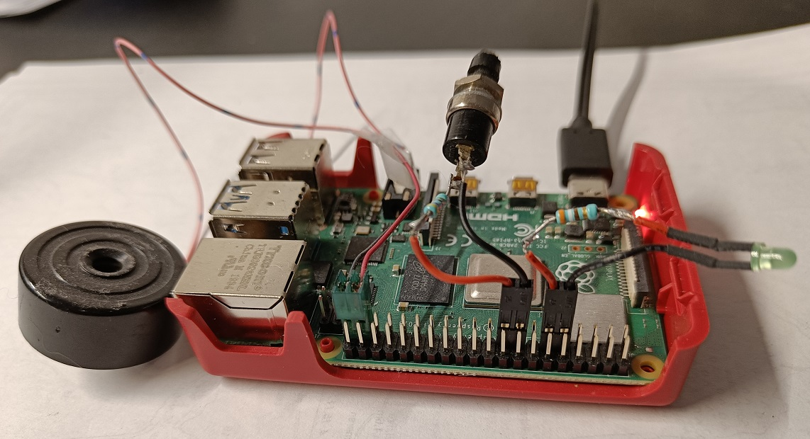

# Raspberry Pi 4 Model
This repo contains Raspberry Pi 4 Model B projects written in C# using .NET.

| Folder | Content |
|--------|---------|
| led-flasher       | Simple console program that flashes an LED. |
| button-poller     | Simple console program that turns on an LED and a buzzer while a button is pressed. |
| bluetooth-scanner | Simple console program that scans for Bluetooth devices. Uses the BlueZ Bluetooth stack. |
| relay-board       | Simple console program that controls the relays on a relay HAT board. |
| web-app           | ASP.NET web application that controls GPIO pins. Input pin states are pushed to browser using SignalR. |

These projects can run both on Raspian and Ubuntu for Raspberry Pi.

## Login

The Raspberry PI appears on the network with hostname **raspberry**.

Turn on the Raspberry PI and it will connect to WiFi. You ping the hostname **raspberry**.

## GPIO Ports

GPIO connector pinout on a Raspberry Pi 4

See also 
* https://www.raspberrypi.org/documentation/usage/gpio/
* https://darenmay.com/blog/net-core-and-gpio-on-the-raspberry-pi---leds-and-gpio/
* https://www.hanselman.com/blog/InstallingTheNETCore2xSDKOnARaspberryPiAndBlinkingAnLEDWithSystemDeviceGpio.aspx

**IMPORTANT** 
**You must be root to control GPIO pins.**

## IO connections for *led-flasher* and *button-poller* projects

## Bluetooth
* http://www.bluez.org/ - BlueZ - The official Linux Bluetooth protocol stack.
* https://www.nuget.org/packages/HashtagChris.DotNetBlueZ - .NET Core NuGet package using BlueZ.

    sudo apt install bluez

## Webcams

Links regarding how to use standard USB webcams with a Raspberry Pi:

* https://www.raspberrypi.org/documentation/usage/webcams/
* https://motion-project.github.io/

## Audio

Audio can be played either on HDMI or the 3.5 mm jack plug (default).

To enable audio on Ubuntu:

Insert this line in /boot/firmware/usercfg.txt: 
dtparam=audio=on

To list available sound playback (speaker) devices:

    sudo aplay -L
or 

    sudo aplay -l

To list available sound recording (microphone) devices:

    sudo arecord -L

or 

    sudo arecord -l

Audio can be tested by the **speaker-test** command.

    sudo speaker-test -t wav

.wav files can be played with **aplay**

To test audio on a Jabra SPEAK 410 USB speakerphone:

    sudo speaker-test -Dplughw:USB -t wav

To make a 5 second recording to a file:

    sudo arecord -f cd --duration=5 -Dplughw:USB --file-type=raw out.raw

Playback and recording levels can be configured (in console mode) by running this command

    alsamixer

### MP3

omxplayer-pi is not available on Ubuntu ARM64

MP3 files can be played with **mpg321**

To install mpg321

    sudo apt install mpg321

## Google Assistant

See https://pimylifeup.com/raspberry-pi-google-assistant/

--------------

## Relay Board HAT

RPI Relay Board

1. Raspberry Pi GPIO interface: for connecting Raspberry Pi
2. Relay screw terminal: for connecting target devices
3. Relays
4. Photocoupler: PC817
5. Relay indicator
   * LED on: relay NC is opened, NO is closed
   * LED off: relay NC is closed, NO is opened
6. Power indicator
7. Relay control jumper
   * short the jumper: control the relays by default I/Os used in the example code
   * open the jumper: control the relays by custom I/Os through jumper wires

### Documentation and Sample Code

https://www.waveshare.com/wiki/RPi_Relay_Board

--------------

## Temperature and Humidity Sensor

DHT11 Digital temperature and humidity sensor with single-wire interface.

https://whadda.com/product/dht11-digital-temperature-humidity-sensor-module-wpse311/
